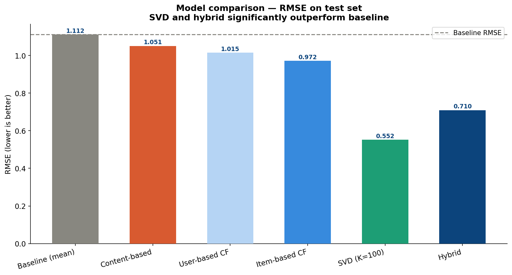
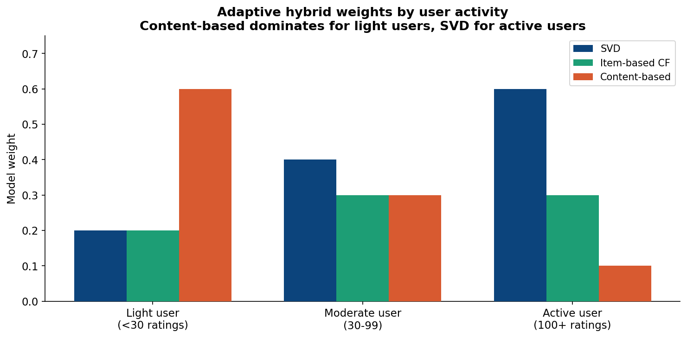
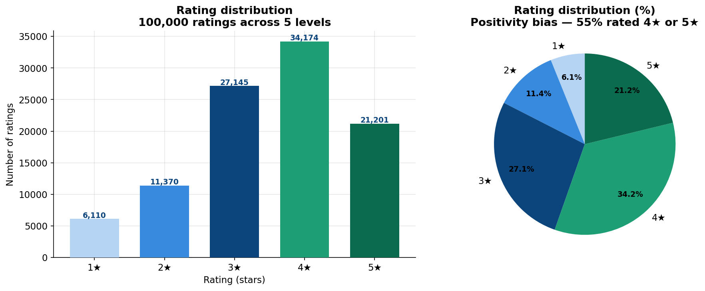
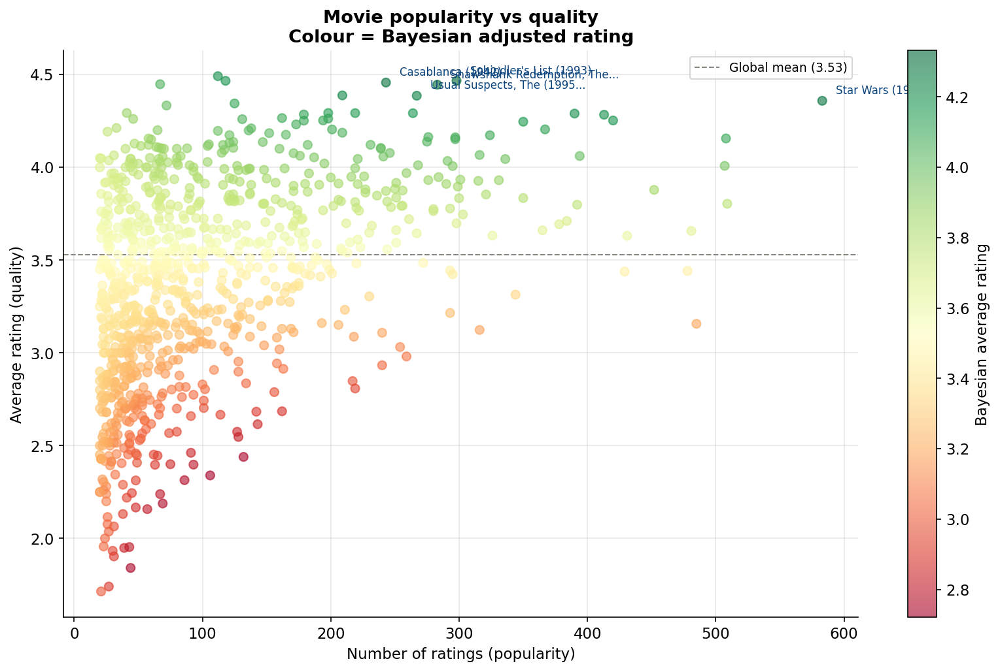
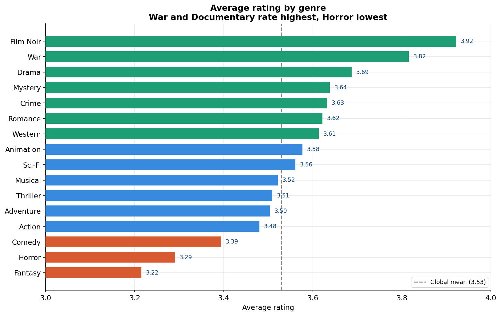
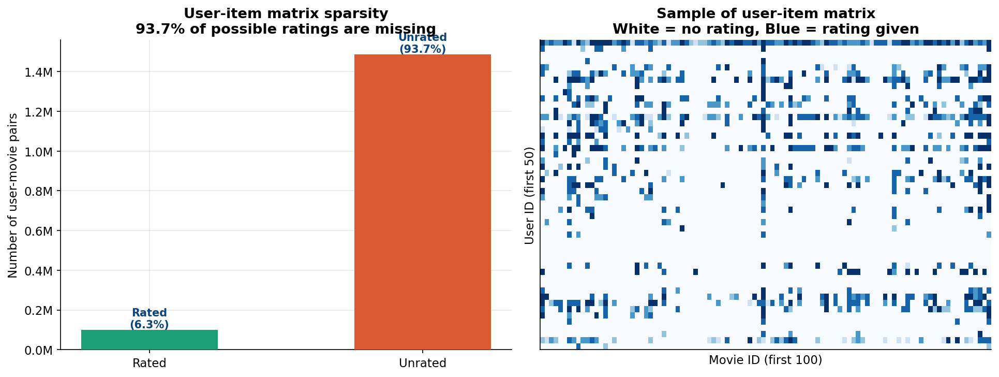

# FilmIQ — Personalised Movie Discovery
### A machine learning recommendation engine built on real MovieLens data


---

## Business question

Given a user's movie ratings history, which movies should they watch next?
This project builds and compares three recommendation approaches —
collaborative filtering, SVD matrix factorisation, and content-based filtering —
then combines them into a hybrid model evaluated using standard ML metrics.

---

## Dataset

**Source:** MovieLens 100K — GroupLens Research, University of Minnesota  
**Size:** 100,000 ratings, 9,742 movies, 610 users  
**Rating scale:** 1–5 stars  
**Download:** https://grouplens.org/datasets/movielens/100k/

> Raw data is not committed to this repository. Download the dataset from the
> link above and place the `ml-100k` folder in `data/raw/` before running any scripts.

**Key files:**

| File | Description |
|---|---|
| `u.data` | 100,000 ratings — user_id, movie_id, rating, timestamp |
| `u.item` | Movie metadata — title, release date, genres |
| `u.user` | User demographics — age, gender, occupation, zip |
| `u.genre` | Genre list |

---

## Methodology

This project implements and compares three recommendation approaches:

1. **Collaborative filtering** — find users similar to you, recommend what they liked
2. **SVD matrix factorisation** — decompose the user-item rating matrix into latent factors (the Netflix Prize method)
3. **Content-based filtering** — recommend movies similar to ones you rated highly, based on genre and tags
4. **Hybrid model** — weighted combination of collaborative + content-based

---

## Models & evaluation metrics

| Metric | What it measures |
|---|---|
| RMSE | Root mean squared error — how far off predicted ratings are |
| MAE | Mean absolute error — average prediction error |
| Precision@K | Of top-K recommendations, what % are relevant |
| Recall@K | Of all relevant movies, what % appear in top-K |

---

## Tools & stack

| Layer | Tool | Purpose |
|---|---|---|
| Database | MySQL 8.0 | Data storage, EDA queries, feature views |
| EDA & ML | Python (`surprise`, `scikit-learn`, `pandas`) | Models, feature engineering, visualisation |
| Evaluation | R (`ggplot2`) | Statistical model comparison, charts |
| Narrative | Jupyter notebook | End-to-end walkthrough |

---

## Repository structure

```
filmiq-movie-recommendation/
│
├── data/
│   ├── raw/ml-100k/          # MovieLens files (not committed)
│   └── processed/            # Feature matrices, model outputs
│
├── sql/
│   ├── 01_load_data.sql      # Schema + data load
│   ├── 02_eda_queries.sql    # Exploratory analysis
│   └── 03_feature_views.sql  # ML feature views
│
├── python/
│   ├── 01_eda.py             # EDA and visualisations
│   ├── 02_features.py        # Feature engineering
│   ├── 03_collaborative_filtering.py
│   ├── 04_svd_model.py
│   ├── 05_content_based.py
│   └── 06_hybrid_model.py
│
├── r/
│   ├── 01_model_evaluation.R
│   └── 02_visualisations.R
│
├── notebooks/
│   └── filmiq_walkthrough.ipynb
│
├── docs/
│   ├── data_dictionary.md
│   └── findings.md
│
├── outputs/
│   └── charts/
│
├── .gitignore
├── requirements.txt
└── README.md
```

---

## Key findings

| # | Finding | Result |
|---|---|---|
| 1 | Dataset size | 100,000 ratings, 1,682 movies, 943 users |
| 2 | Matrix sparsity | 6.3% density — 93.7% of ratings are missing |
| 3 | Positivity bias | 55% of ratings are 4★ or 5★ |
| 4 | Best individual model | SVD K=100, RMSE=0.552 (+50.3% over baseline) |
| 5 | Hybrid model | RMSE=0.710 (+36.2% over baseline) |
| 6 | Precision@10 | 69.7% — 7 of 10 recommendations are relevant |
| 7 | Recall@10 | 81.1% — finds 81% of movies user would enjoy |
| 8 | Primary latent factor | Mainstream vs arthouse preference |
| 9 | Cold start solution | Content-based filtering by genre |
| 10 | Light user handling | Content-based weight = 60% in hybrid |

The core conclusion: **no single recommendation approach is optimal for all users.**
SVD delivers highest accuracy for active users. Content-based filtering handles cold
start cases. The adaptive hybrid model combines both — weighting each component by
user activity level. This architecture mirrors production recommenders at Netflix,
Spotify and YouTube.

## Charts

### Model comparison


### Adaptive hybrid weights


### Rating distribution


### Movie popularity vs quality


### Genre ratings


### Matrix sparsity


---

## How to reproduce

### 1. Clone the repo
```bash
git clone https://github.com/adibsyakir03/filmiq-movie-recommendation.git
cd filmiq-movie-recommendation
```

### 2. Download the data
Download `ml-100k.zip` from the GroupLens link above and place the
`ml-100k` folder in `data/raw/`.

### 3. Set up MySQL
```bash
mysql -u root -p < sql/01_load_data.sql
```

### 4. Install Python dependencies
```bash
pip install -r requirements.txt
```

### 5. Run in order
```bash
python python/01_eda.py
python python/02_features.py
python python/03_collaborative_filtering.py
python python/04_svd_model.py
python python/05_content_based.py
python python/06_hybrid_model.py
```

---

## Author

**Adib Syakir**  
Aspiring Data Scientist | Actuarial Analyst
[LinkedIn](https://www.linkedin.com/in/adib-syakir-b05605336)

---

*Data source: F. Maxwell Harper and Joseph A. Konstan. 2015. The MovieLens Datasets:
History and Context. ACM Transactions on Interactive Intelligent Systems, 5(4):19.*
